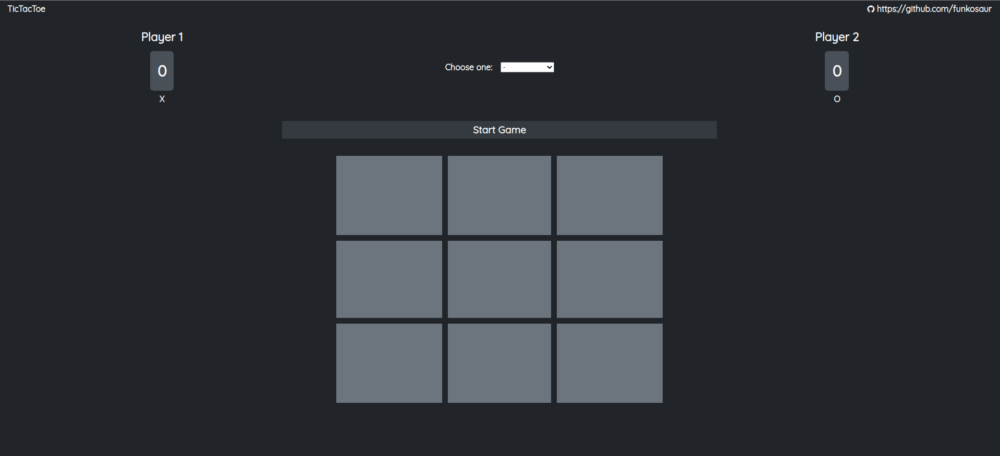

# TicTacToe

> This is a Tic Tac Toe game with extensive use of the module pattern

## Table of contents

- [Overview](#overview)
  - [Features](#features)
  - [Screenshot](#screenshot)
  - [Links](#links)
- [My process](#my-process)
  - [Built with](#built-with)
- [Author](#author)

## Overview

### Features

- [x] Play versus a second player
- [x] Keeps score until you restart the game
- [x] Play versus a computer with randomized choices

### Screenshot

### Links

> View the project [here](https://funkosaur.github.io/calculator/)

## My process

### Built with

- HTML5
- CSS
- Flexbox
- CSS Grid
- Desktop-first workflow
- Javascript

## Author

- Website - [Mario Boykovski](https://funkosaur.github.io/TicTacToe/)
